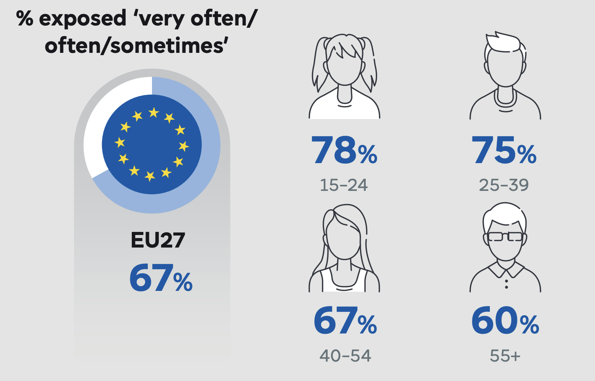

  <picture>
    <source media="(prefers-color-scheme: dark)" srcset="logo/logo_white.png">
    <source media="(prefers-color-scheme: light)" srcset="logo/logo_black.png">
    
  </picture>

## What is Aletheia?

Aletheia helps people cut through misinformation by fact-checking claims and synthesizing news from multiple credible sources. In an age where AI can generate convincing fake content and misinformation spreads faster than truth, Aletheia provides a way to quickly verify what you see online.

---

## The Problem

- People consume news primarily through social media (TikTok, Instagram, Twitter etc...)
- Verifying information across multiple sources is time-consuming
- Traditional fact-checking is too slow for real-time misinformation
- Generic AI tools can hallucinate on very recent news and will always have a bias toward their training data.

  

  Share of EU citizens reporting exposure to fake news at least occasionally in the past 7 days

  Source: Social Media Survey 2025 | European Union Survey

---

## The Solution

Aletheia provides three ways to verify information:

### 1. **Quick Fact-Check (Mobile App)**
- Send a TikTok/Instagram link, viral tweet or claim
- Get instant verification with sources 
- See if it's true, false, with added context

### 2. **Deep Analysis (Browser Extension)**
- Research complex topics with multi-source synthesis
- Entity relationship mapping (who's involved, how they're connected)
- Timeline views of how stories developed
- Qualitative analysis + quantitative data

### 3. **Curated Newsletter**
- Weekly digest of verified news
- Synthesized from 50+ credible outlets
- Customizable by topic and interest
- Consume news the way you want it 
---

## What Makes It Different

**vs. Ground News:** We synthesize different perspective from all over the world from all over the political spectrum. Helping you make your own opinion on the matter.

**vs. traditional AI models:** News-specific, grounded purely in credible sources, no hallucination

**vs. Manual fact-checkers :** Real-time and scalable

**Key differentiators:**
- Grounded exclusively in credible journalistic sources
- Combines qualitative (text analysis) + quantitative (data verification)
- Multiple surfaces: quick mobile checks + deep desktop research
- Transparent sourcing (always shows where information comes from)

---

## Tech Stack

**Backend:** Python, FastAPI  
**Frontend:** React, TypeScript  
**AI/ML:** State of the art tuned LLM 
**Data:** PostgreSQL, vector DB for semantic search  
**Infrastructure:** Self-hosted (NAS + cloud hybrid)

---

## Roadmap

### Phase 1: Core Verification (Current)
- Multi-source news synthesis
- Basic fact-checking
- Browser extension + newsletter

### Phase 2: Deep Analysis (April-June 2026)
- Entity relationship mapping
- Timeline visualization
- Quantitative data integration (economic, health, climate)

### Phase 3: Scale (Post-Beta)
- Mobile app refinement
- B2B features (journalist tools, team workspaces)
- API for third-party integrations

---

**Note:** This is an early-stage project. The code is not public as we're validating the concept and preparing for beta launch.

---

## License

TBD - Currently private during development

---
